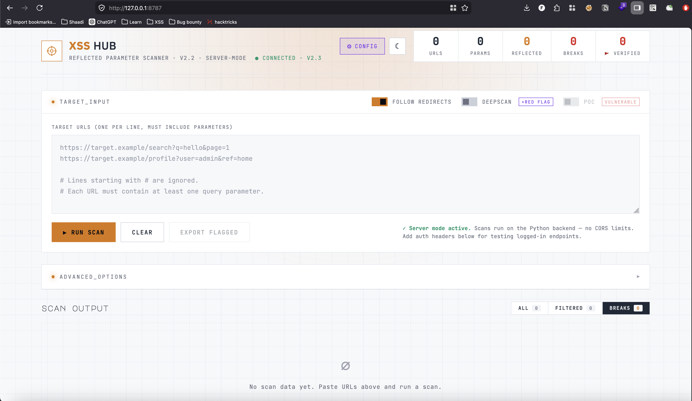
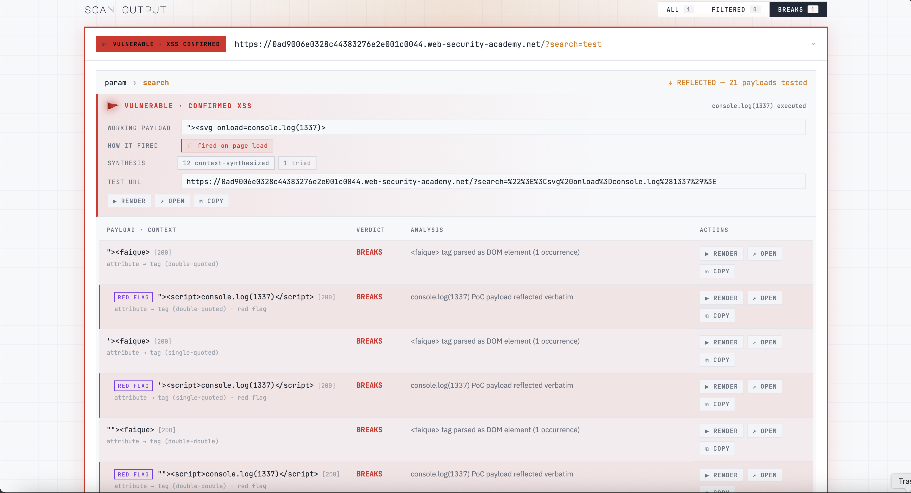
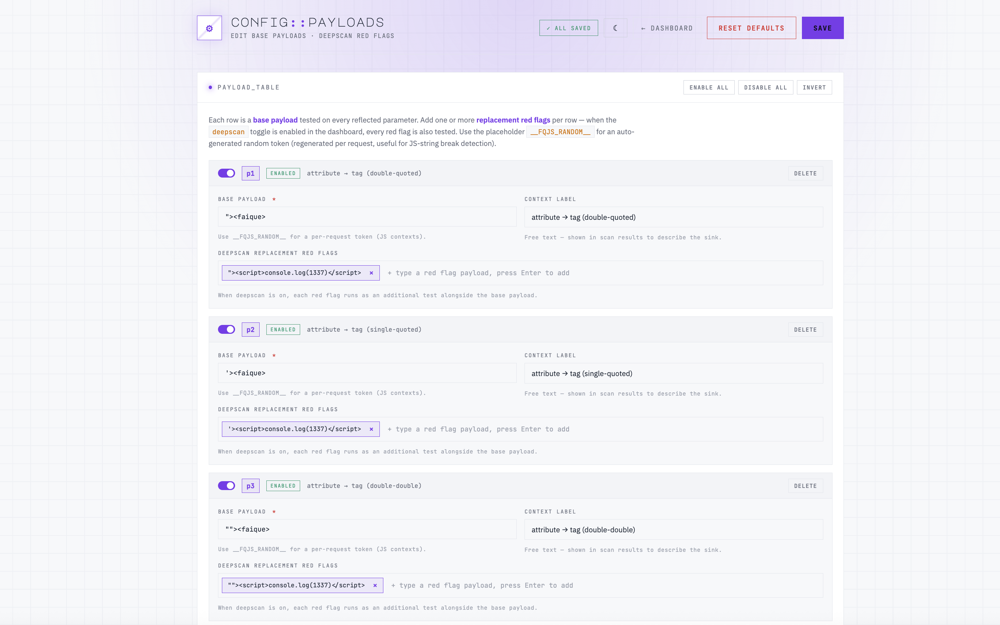

# 🎯 XSS HUB

**Fast, local, reflected-XSS scanner with browser-confirmed PoC generation.**

No cloud. No API keys. No AI. Just deterministic scanning that runs entirely on your machine.



---

## ✨ Features

- 🔍 **Differential DOM detection** — catches ``, `<script>`, `<iframe>` injection that simple blacklists miss
- 🚩 **Browser-confirmed PoC** — runs payloads in headless Chromium, confirms `console.log(1337)` actually fires
- 🧠 **Conditional cascading** — only does work that matters (no wasted requests)
- 🎯 **Editable payloads** — enable/disable per row, bulk operations, custom red flag variants
- 🌗 Light/dark theme · 🔌 HTTP proxy support · 📦 Single-file Python backend

---

## ⚡ Quick install

```bash
git clone https://github.com/YOUR_USERNAME/xss-hub.git
cd xss-hub
pip install -r requirements.txt
playwright install chromium    # optional, needed for PoC
python server.py
```

Open **http://127.0.0.1:8787** 🚀

---

## 🖥️ Usage

### 1. Paste URLs and run



Each URL must contain at least one query parameter. Toggle features as needed:

| Toggle | What it does |
|---|---|
| **Deepscan** | Runs `console.log(1337)` red flag payloads when a base breaks |
| **PoC** | Confirms execution in headless Chromium *(requires Deepscan)* |
| **Follow redirects** | Standard HTTP behaviour |

### 2. Read the results


| Badge | Meaning |
|---|---|
| 🚩 `VULNERABLE · XSS CONFIRMED` | PoC fired in real browser |
| `BREAKS HTML` | Payload escaped its context |
| `REFLECTED · SAFE` | Echoes but every payload was escaped |
| `NO REFLECTION` | Parameter not reflected |

### 3. Edit payloads at `/config`



Per-payload enable/disable, bulk operations, custom red flag variants.

---

## 🧪 Try it locally

A vulnerable test server ships with the repo:

```bash
python test_target.py    # → http://127.0.0.1:9999
```

Then scan from the dashboard:

```
http://127.0.0.1:9999/body?q=h
http://127.0.0.1:9999/attr?name=h
http://127.0.0.1:9999/safe?q=h
http://127.0.0.1:9999/js?q=t
```

Expected: `/body`, `/attr`, `/js` flag as **vulnerable**; `/safe` shows **reflected · safe**.

---

## 🔌 API

All features are also available via JSON API. Example:

```bash
curl -sN -X POST http://127.0.0.1:8787/api/scan \
  -H 'Content-Type: application/json' \
  -d '{
    "urls": ["https://target.example/?q=test"],
    "deepscan": true,
    "poc": true
  }' | jq -c 'select(.type=="url_done")'
```

| Endpoint | Method | Purpose |
|---|---|---|
| `/api/health` | GET | Server status + Playwright availability |
| `/api/config` | GET / POST | Get or save the payload library |
| `/api/config/reset` | POST | Restore default 9 payloads |
| `/api/scan` | POST | Run a scan (returns NDJSON stream) |

---

## 🧭 Detection pipeline

```
probe ──▶ bases ──▶ [if any broke] red flag ──▶ [if confirmed] PoC
```

Seven-stage detection, first-match-wins:

1. `console.log(1337)` reflection
2. Custom-tag injection (`<faique>`)
3. **Differential** standard-tag injection (``, `<script>`)
4. Custom-attribute injection (`data-fqprobe`)
5. **Differential** standard-attribute injection (`onclick`, `autofocus`)
6. JS string-token break inside `<script>`
7. Static fallback for quoted reflection

---

## 📁 Project structure

```
xss-hub/
├── server.py          # Backend (Flask + detection + headless PoC)
├── index.html         # Dashboard UI
├── config.html        # Payload editor
├── test_target.py     # Local vulnerable server for testing
├── payloads.json      # Auto-created on first run
├── requirements.txt
└── README.md
```

---

## ⚠️ Authorized use only

Test only systems you **own** or have **explicit permission** to test. You are responsible for how you use this software.

---

## 📸 Adding screenshots before pushing

This README references four images in `docs/`:

```
docs/
├── dashboard.png    # main dashboard with URLs and toggles
├── scan.png         # scan in progress with phase indicators
├── results.png      # results panel with VULNERABLE badge
└── config.png       # payload editor at /config
```

Take these from your running tool, save them in `docs/` at the repo root, then `git add docs/`.

---

## 📜 License

MIT — see [LICENSE](LICENSE).
